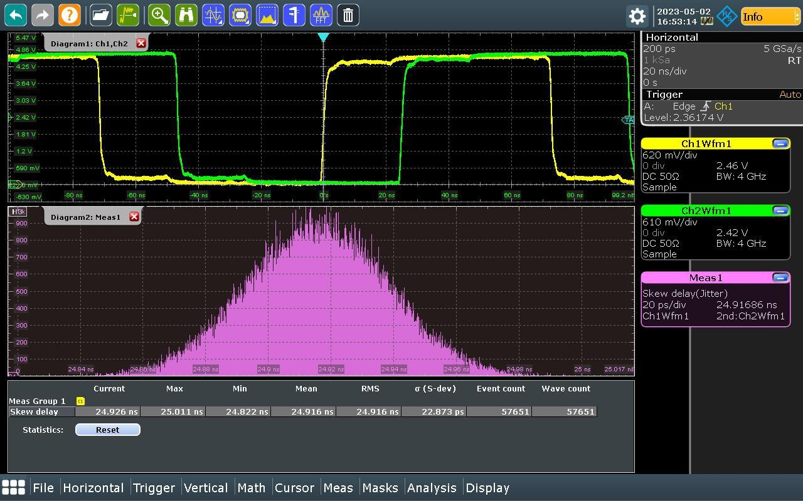

Latency and Jitter
==================

Measuring Latency & Jitter
--------------------------

General Test Conditions:

- 0.144 μs clock period (~7MHz). This was the highest frequency that behaved consistently (see known issues section).
- Package versions on all PandAs:
    - panda-fpga PandABox-no-fmc-sfp1_sync-3.0a2-162-gc398fbf
    - panda-server zynq-3.0a3-31-g5f6f165
    - panda-slowfpga b681574
    - panda-webcontrol 2.1-8-g7aa28e8
    - panda-webcontrol-no-subnet-validation 2.1-8-g7aa28e8
- Rohde & Schwarz RTO2044 oscilloscope set-up and measurement taking:
    - Connect the two TTL outputs, that you wish to compare, to two different channel inputs on the front of the oscilloscope.
    - Press the "Autoset" button on the oscilloscope to get most settings into the right ballpark.
    - You should then see two square waves onscreen.
    - For our tests, both channels were manually vertically scaled to 1V/div, and given an offset of 2.5V; but feel free to set them to something more comfortable for you, as long as you use the same for both channels.
    - Select "Analysis" from the bottom toolbar.
    - Select "Jitter Wizard" from the list that pops up.
    - On the first screen, select "Skew" as the measurement type (for more info see https://www.rohde-schwarz.com/webhelp/RTO_HTML_UserManual_en/Content/2ff5499f0f6f4cd5.htm).
    - On the second screen, make sure that the two channels that your square waves are on are selected. The original (clock block direct output) waveform should be selected as "Channel source 1", and the other waveform that you want to compare to it should be selected as "Channel source 2". "Edge polarity" shouldn't matter, but "Positive" was used for these tests. Finally, since you shouldn't be able to change it, "Relative Polarity" should already be set to "Matching".
    - On the third screen, select "Retain current settings" in all three boxes.
    - On the fourth screen, the slider buttons for "Source signal" and "Histogram of measurement" should be on (righthand side) and the other two ("Track of measurement" & "FFT spectrum of track") should be off (lefthand side).
    - Click "Execute"!
    - Check the trigger options to check that it's still triggering off the leading edge of your original (source of truth) waveform, it may well have switched to triggering off the other channel.
    - Reduce the horizontal scale down to the smallest resolution where there is still at least one wavelength visible on the screen.
    - Wait until the "Event count" exceeds 50,000, to ensure we have captured enough data for our sample to be representative.
    - Take a screenshot through the web interface
    - It should look something like this.

Baseline Measurements
---------------------

Specific Test Conditions:

- Connected like so: PandA-02, and for the roundtrip measurement: PandA-05.
- Giving a network arrangement of this, and for the roundtrip measurement this.

.. image:: ../../images/Baseline2.png
   :width: 600

Results:

========================== ====================== ========== ========== ====================== ========== ========== ======================= ========== ===========
Link Method                Internal Clock Latency Internal Clock Jitter External Clock Latency External Clock Jitter Recovered Clock Latency Recovered Clock Jitter
-------------------------- ---------------------- --------------------- ---------------------- --------------------- ----------------------- ----------------------
|                                                 Range      σ                                 Range      σ                                  Range      σ
========================== ====================== ========== ========== ====================== ========== ========== ======================= ========== ===========
Hard Metal Loopback        273 ns                 ±79.80 ps  18.190 ps  273 ns                 ±76.75 ps  18.078 ps  N/A                     N/A        N/A
Short Fiber Optic Loopback 273 ns                 ±73.55 ps  18.091 ps  273 ns                 ±69.75 ps  17.914 ps  N/A                     N/A        N/A
Long Fiber Optic Loopback  278 ns                 ±72.70 ps  18.146 ps  278 ns                 ±71.05 ps  18.079 ps  N/A                     N/A        N/A
PandA to PandA Roundtrip   N/A                    N/A        N/A        555 ns                 ±69.50 ps  16.660 ps  555 ns                  ±68.70 ps  16.425 ps
========================== ====================== ========== ========== ====================== ========== ========== ======================= ========== ===========

Ring Configuration
------------------

Specific Test Conditions:

- Connected like so: PandA-02, PandA-05, and PandA-03.
- Giving a network arrangement of this.

Results:

========= ========= ========= ================== ========== ========= =================== =========== ========= ==================== ========== =========
Clock Type                    Delay After 1 Link Jitter After 1 Link  Delay After 2 Links Jitter After 2 Links   Delay After 3 Links Jitter After 3 Links
----------------------------- ------------------ -------------------- ------------------- --------------------- -------------------- --------------------
PandA-02  PandA-05  PandA-03                     Range      σ                             Range       σ                              Range      σ
========= ========= ========= ================== ========== ========= =================== =========== ========= ==================== ========== =========
Internal  Recovered Recovered 276 ns             ±657.95 ps 114.00 ps 545 ns              ±1209.55 ps 168.78 ps 847 ns               ±98.35 ps  24.869 ps
External  External  External  269 ns             ±124.75 ps 29.646 ps 533.5 ns            ±134.50 ps  30.025 ps 822.5 ns             ±112.50 ps 25.224 ps
External  Recovered Recovered 276 ns             ±128.60 ps 31.322 ps 545 ns              ±134.10 ps  32.376 ps 839 ns               ±100.60 ps 25.137 ps
Recovered Recovered Recovered 276.5 ns           ±136.05 ps 32.778 ps 565 ns              ±136.35 ps  33.231 ps 847 ns               ±103.85 ps 24.901 ps
========= ========= ========= ================== ========== ========= =================== =========== ========= ==================== ========== =========

Star Configuration
------------------

Specific Test Conditions:

- Connected like so: PandA-02, PandA-05, and PandA-03.
- Giving a network arrangement of this.

Infinitely Recycled Clock Drift
-------------------------------

Specific Test Conditions:

- 40ns clock period (25MHz).
- Used the previous PandABlocks-FPGA package version: panda-fpga PandABox-no-fmc-sfp1_sync-3.0a2-161-g57dda12
- Connected like so: PandA-02, PandA-05, and PandA-03.
- Giving a network arrangement of this.

Results:

After being left for 112.5 hours, the mean clock period was still measured to be within 0.01ns of the mean clock period initially measured at the start. So it is clear that there was no significant drift in the clock period/frequency over the duration of the test.

The jitter in the clock period was measured to be:

===== ======== =========
Time  Jitter
----- ------------------
|     Range    σ
===== ======== =========
Start ±71.0 ps 17.303 ps
End   ±77.5 ps 17.569 ps
===== ======== =========

N.B. The oscilloscope was only switched on at the start and end of the test and was not left on during the unsupervised time, so it is possible that a significant deviation in clock period both occurred and was self-corrected during the unsupervised time.
