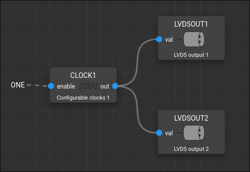

Test the finedelay
==================

1. Plug two LVDSOUT pins to an oscilloscope and use rising edge of LVDSOUT1
   as trigger.

2. Enable CLOCK1, set its period to the minimum(0.016us) and use it as input for
   LVDSOUT1 and LVDSOUT2.

3. Set oct delay and fine delay to 0 in both LVDSOUTs.

4. For LVDSOUT2, set oct delay from 1 to 7 and verify in the oscilloscope that
   you get delays from 1ns to 7ns respectively, then set oct delay back to 0.

5. Read initial one ns of LVDSOUT2 and use it as a reference to test fine delay.

  5.1 Set fine delay to half of initial one ns and verify in the oscilloscope
  that the delay is around 500ps.

  5.2 Set fine delay to a quarter of initial one ns and verify in the
  oscilloscope that the delay is around 250ps.

  5.3 .... Repeat halving until you reach the limit of your oscilloscope ...

6. Run a script_ that sweeps all fine delay values for each oct delay value and
   observe how LVDSOUT2 gets delayed very smoothly.

.. _script: https://raw.githubusercontent.com/PandABlocks/PandABlocks.github.io/refs/heads/main/scripts/finedelay-sweep.py
